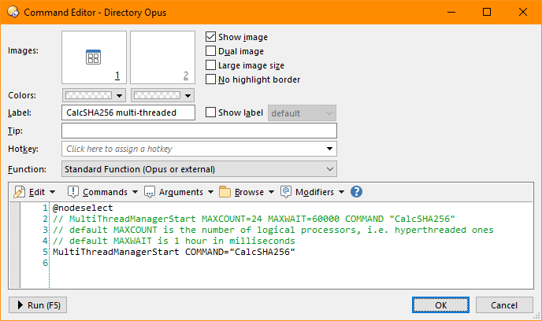
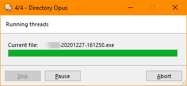
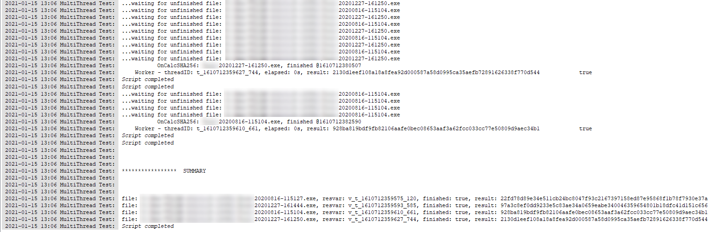

# DOpus_MultiThreading
Multi-threaded wrapper for user commands for Directory Opus, using Script.Vars as async communication channel.

This is only a proof of concept, so take it as it is.

To test this, create a new button as such:

**@nodeselect**
**// MultiThreadManagerStart MAXCOUNT=24 MAXWAIT=60000 COMMAND "CalcSHA256"**
**// default MAXCOUNT is the number of logical processors, i.e. hyperthreaded ones**
**// default MAXWAIT is 1 hour in milliseconds**
**MultiThreadManagerStart COMMAND="CalcSHA256"**

Basically the command which needs to be run in parallel, "CalcSHA256" in this case, must at least have a parameter called
    **RESVAR (e.g. cmd.template='RESVAR/K, ...')**
and must set it before returning, e.g.
    **Script.vars.Set(resvar) = any_JS_value_object_etc;**
and the Thread Manager and Thread Workers will take care of the rest.

The reason why RESVAR is necessary is that there is no possibility for Script Commands to directly return a value with standard JS, i.e. 'return myval;' ...that doesn't work.

And since we run basically everything via 'dopusrt /acmd' anyway, the target command "CalcSHA256" is run completely asynchronously in a thread from which we would have no possibility to receive the return value.

Now you know.

## Application areas

There are many application areas apart from just hashing. There are many excellent CLI tools which process files but are single-threaded, e.g. various .PNG optimizers, ffmpeg, wget... These can be easily converted to multi-threaded workers now. Or you could write your own server pinger, web page fetchers and run it in parallel. If **it** can be run, now **it** can be run in parallel.

## Benchmarks

I did a very quick, rough benchmark; 4 files of total 15 GB on an AMD 3900x comparing single-thread vs multi-thread, where ST runtime is measured using "CalcSHA256" as a DOpus column.

RamDisk:

- ST: ≈57.8s
- MT: ≈22.3s
- ST (2nd run right after MT): ≈57.9s

NVME:

- ST: ≈63.2s
- MT: ≈22.4s
- ST (2nd run right after MT): ≈58.1s

So MT greatly increases hashing speed as long as you use a  non-spinning drive. If I had used more files, it probably would have helped even more; the CPU reached ≈18% max and quickly dropped as soon as some files were finished.

The number 18% seems quite reasonable to me, on a 24 HT-core machine, the estimated CPU usage per core would be 100/24 ≈ 4.2% if each core would process 1 file exclusively, and since I used 4 files, 18% sounds ok.

Also note the difference between ≈60s in ST mode vs ≈22s in MT mode. The expected MT runtime is not as simple as dividing 60/4 = 15s and asking if the difference is the MT overhead. The diff comes not only from MT overhead but also depends on the longest running tasks, because the MT manager must wait at the very least for the longest running task (the biggest 5.7 GB file to hash in this case) even if it were running for 1 file.

To verify this, I copied a single file 24 times with sequential names, a total 31GB:

RamDisk:

- MT: ≈9.5s(!) - Peak CPU: 86.9%.
- ST: ≈125s(!) - Peak CPU: 5%s

NVME:

- MT: ≈20s - Peak CPU: 29.3%
- ST: not measured

Basically no file requires longer than the other. Note how the MT runtime immensely drops from 22.3s to 9.5s on RamDisk and to 20s on NVME despite twice the total size of initial benchmark. Also note the CPU usage differences between the two: On a RamDisk, disk speed is not the bottleneck and all cores are equally utilized almost to the max, but even on a very fast NVME, the CPU stops being the bottleneck and the disk read speed starts holding the CPU back.

==> Multi-threading helps immensely, regardless of the MT overhead or disk speed, as long as it not a classical HDD.

## Screenshots

##### Button configuration

##### Progress window

##### Sample output

